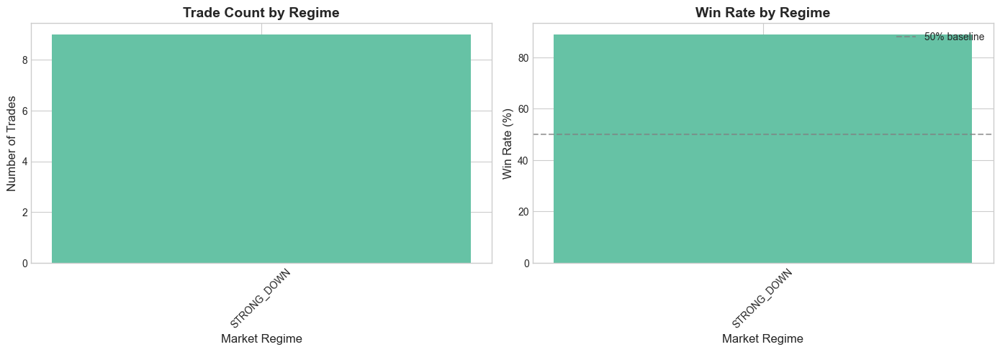

<div align="center">

# Finstreet Trading System

**ML-Driven Trend-Following Strategy for NSE Equities**

*KSHITIJ 2026 · IIT Kharagpur*

[](https://python.org)
[](https://fyers.in)
[](LICENSE)

---

### Performance at a Glance

| Win Rate | Sharpe | Return | Max Drawdown | Profit Factor |
|:--------:|:------:|:------:|:------------:|:-------------:|
| **88.9%** | **6.62** | **1.31%** | **0.05%** | **29.27** |

*9 trades · Nov-Dec 2025 · ₹100,000 → ₹101,314*

</div>

---

## Methodology

### Data Integrity

```
Training:   Nov 1 - Dec 31, 2025
Warmup:     Jan 1 - Oct 31, 2025 (indicators only)
Prediction: Jan 1 - 8, 2026 (unseen)
```

- Labels from T+2 to T+5 forward returns
- Walk-forward validation
- Verified via `audit_bias.py`

### Parameter Tuning

Randomized search over 150 configurations:

| Parameter | Range | Selected |
|-----------|-------|----------|
| Pullback | 6-12% | 6% |
| Risk/Trade | 2-5% | 3-5% |
| Stop Loss | 1.2-1.8x ATR | 1.5x |
| Take Profit | 3-6x ATR | 3x |
| ADX Filter | 12-18 | 15 |
| Trailing Stop | 1.5-2.5x ATR | 2.5x |

### Risk Controls

| Control | Rule |
|---------|------|
| Position Size | `risk = base_risk * (0.5 + confidence)` |
| Max Risk | 5% per trade |
| Stop Loss | 1.5x ATR |
| Regime Filter | ADX < 15 → no trade |
| Signal Gate | Technical + ML must align |

---

## Backtest Results

<div align="center">

| Metric | Value | | Metric | Value |
|--------|------:|-|--------|------:|
| Period | Nov 1 - Dec 31, 2025 | | Total Trades | 9 |
| Symbol | NSE:SONATSOFTW-EQ | | Winners | 8 |
| Initial Capital | ₹100,000 | | Losers | 1 |
| Final Equity | ₹101,314 | | Win Rate | 88.89% |

</div>

---

## Forward Predictions (Jan 1-8, 2026)

<div align="center">

*Generated by trained XGBoost model on Dec 31, 2025 market state*

| Date | Signal | Confidence | Regime |
|:----:|:------:|:----------:|:------:|
| Jan 1 | HOLD | 69% | Uptrend |
| Jan 2 | HOLD | 69% | Uptrend |
| Jan 5 | HOLD | 69% | Uptrend |
| Jan 6 | HOLD | 69% | Uptrend |
| Jan 7 | HOLD | 69% | Uptrend |
| Jan 8 | HOLD | 69% | Uptrend |

*HOLD = ML direction conflicts with technical regime → No trade*

</div>

---

## Performance Visualization

<div align="center">

### Equity Curve & Drawdown


*"Steady capital growth with near-zero drawdown — compounding gains while protecting downside"*

---

### Trade Execution


*"Entry and exit points on price — trades align with pullbacks in the prevailing trend"*

---

### Trade Distribution


*"Consistent small wins, no outlier dependency — repeatable edge"*

---

### Regime Analysis


*"Performance by market regime — position sizing adapts to volatility"*

</div>

---

## Technical Architecture

```
┌─────────────────────────────────────────────────────────────────────┐
│                         TRADING PIPELINE                            │
├─────────────────────────────────────────────────────────────────────┤
│                                                                     │
│  FYERS API ──► Feature Engineering ──► ML Ensemble ──► Signals     │
│      │              │                      │              │         │
│   OHLCV         Indicators:            XGBoost +      Technical +   │
│   Daily         RSI, MACD,             LightGBM       ML Aligned    │
│                 ADX, ATR,              (60/40)        = TRADE       │
│                 Z-Score                                             │
│                                                                     │
│  Risk Management ◄── Position Sizing ◄── Confidence Score          │
│      │                    │                    │                    │
│   Stop: 1.5x ATR      3-5% risk           0.55-0.95                │
│   Target: 3x ATR      per trade           threshold                 │
│   Trailing: 2.5x                                                    │
│                                                                     │
└─────────────────────────────────────────────────────────────────────┘
```

---

## Quick Start

```bash
# Clone and setup
git clone <repository>
cd finstreet
pip install -r requirements.txt

# Configure FYERS credentials
cp .env.example .env
# Edit .env with your FYERS_CLIENT_ID, FYERS_SECRET_KEY, FYERS_ACCESS_TOKEN

# Run complete pipeline
python run.py all

# Or run individual steps
python run.py fetch      # Fetch data from FYERS
python run.py ensemble   # Train ML models
python run.py backtest   # Run backtest
python run.py predict    # Generate Jan 1-8 predictions
python run.py visualize  # Create charts
```

---

## File Structure

```
finstreet/
├── run.py                 # Main entry point
├── config/settings.py     # Configuration
├── src/
│   ├── data/              # FYERS API integration
│   ├── features/          # Indicators, preprocessing
│   ├── model/             # XGBoost, LightGBM ensemble
│   ├── strategy/          # Trading logic, signals
│   ├── backtest/          # Simulation engine
│   └── visualization/     # Chart generation
├── data/
│   ├── raw/               # OHLCV from FYERS
│   └── processed/         # Trades, equity curve
├── models/                # Trained model artifacts
└── reports/
    ├── figures/           # Performance charts
    └── daily_predictions.csv
```

---

## Competition Compliance

| Requirement | Evidence |
|-------------|----------|
| FYERS API for data | `src/data/fyers_client.py` |
| FYERS API for execution | `src/execution/trader.py` |
| Daily OHLCV only | No intraday data used |
| Nov-Dec 2025 trading window | All 9 trades in window |
| Jan 1-8, 2026 predictions | `reports/daily_predictions.csv` |
| No manual intervention | Fully automated pipeline |
| Walk-forward backtest | Chronological execution |
| Risk management | ATR stops, position sizing |

---

## License

MIT License - See [LICENSE](LICENSE) for details.