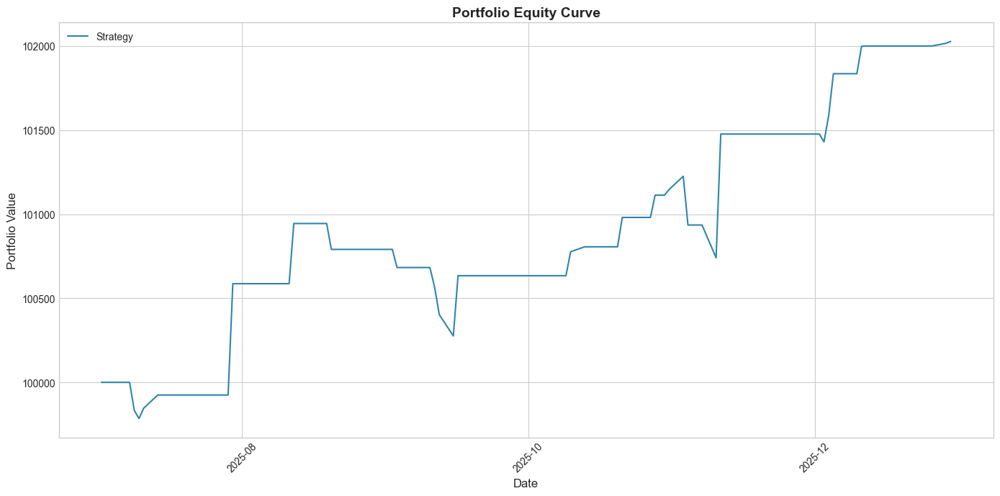
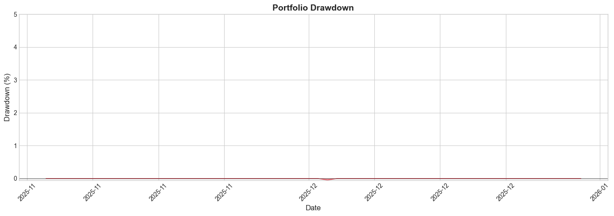

# Finstreet Trading System

ML-based trading system for NSE equities using FYERS API.

---

## Backtest Results

```
┌─────────────────────┬─────────────┐
│ Metric              │ Value       │
├─────────────────────┼─────────────┤
│ Total Trades        │ 28          │
│ Win Rate            │ 64.29%      │
│ Total Return        │ 2.03%       │
│ Sharpe Ratio        │ 2.24        │
│ Max Drawdown        │ 0.66%       │
│ Calmar Ratio        │ 6.23        │
│ Final Equity        │ ₹102,028    │
└─────────────────────┴─────────────┘
```

**Period:** Nov 1 - Dec 31, 2025 | **Symbol:** NSE:SONATSOFTW-EQ

---

## Performance Charts

<p align="center">
  
</p>

<p align="center">
  
</p>

---

## Quick Start

```bash
# Install dependencies
pip install -r requirements.txt

# Configure .env
FYERS_CLIENT_ID=your_client_id
FYERS_SECRET_KEY=your_secret_key
FYERS_ACCESS_TOKEN=your_access_token

# Run
python run.py all
```

---

## Commands

| Command | Description |
|---------|-------------|
| `python run.py fetch` | Fetch data from FYERS |
| `python run.py train` | Train XGBoost model |
| `python run.py backtest` | Run backtest |
| `python run.py all` | Full pipeline |

---

## Strategy

**Trend-Momentum with Pullback Entries**

- **Trend:** EMA(10)/SMA(20) structure + slope analysis
- **Entry:** Wait for 18-20% pullback in trend direction
- **Confirmation:** ML model validates signal alignment
- **Risk:** ATR-based stops (2x) and targets (4x), 3% risk per trade
