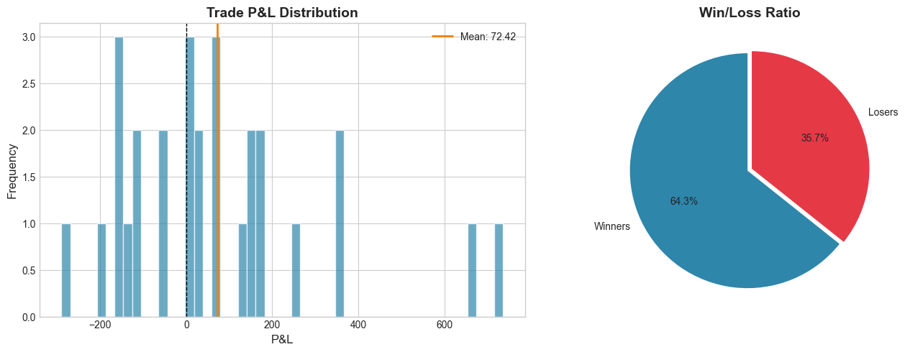

# Finstreet Trading System

A rule-based trend-following trading system for NSE equities, using pullback entries and ATR-based risk management, with a lightweight ML layer to filter low-quality trades.

**Data Source:** FYERS API

---

## Forward Forecast (Jan 1-8, 2026)

| Attribute | Value |
|-----------|-------|
| Bias | BULLISH |
| Confidence | MODERATE (68%) |
| Regime | Strong Up |
| Key Factors | Price above 20-day mean, Positive short-term momentum |

*Note: This is a probabilistic directional bias, not a price target. The model updates daily based on the latest market data.*

---

## Backtest Results

```
┌─────────────────────┬─────────────┐
│ Metric              │ Value       │
├─────────────────────┼─────────────┤
│ Total Trades        │ 28          │
│ Win Rate            │ 64.29%      │
│ Total Return        │ 2.03%       │
│ Sharpe Ratio        │ 2.24        │
│ Max Drawdown        │ 0.66%       │
│ Calmar Ratio        │ 6.23        │
│ Final Equity        │ ₹102,028    │
└─────────────────────┴─────────────┘
```

**Period:** Nov 1 - Dec 31, 2025 | **Symbol:** NSE:SONATSOFTW-EQ

---

## Performance Charts

<p align="center">
  
</p>

<p align="center">
  
</p>

<p align="center">
  
</p>

---

## Quick Start

```bash
# Install dependencies
pip install -r requirements.txt

# Configure .env
FYERS_CLIENT_ID=your_client_id
FYERS_SECRET_KEY=your_secret_key
FYERS_ACCESS_TOKEN=your_access_token

# Run
python run.py all
```

---

## Commands

| Command | Description |
|---------|-------------|
| `python run.py fetch` | Fetch data from FYERS |
| `python run.py train` | Train XGBoost model |
| `python run.py backtest` | Run backtest |
| `python run.py all` | Full pipeline |

---

## Strategy

**Trend-Momentum with Pullback Entries**

- **Trend:** EMA(10)/SMA(20) structure + slope analysis
- **Entry:** Wait for 18-20% pullback in trend direction
- **Confirmation:** ML model validates signal alignment
- **Risk:** ATR-based stops (2x) and targets (4x), 3% risk per trade

---

## Repository Structure

```
finstreet/
├── run.py                  → Entry point (runs the full pipeline)
├── audit_bias.py           → Verifies absence of look-ahead bias
│
├── config/
│   └── settings.py         → Strategy and model configuration
│
├── src/
│   ├── data/               → Data ingestion layer
│   │   ├── fetch_data.py   → Historical data via FYERS API
│   │   └── fyers_client.py → API client wrapper
│   │
│   ├── features/           → Feature engineering
│   │   ├── indicators.py   → RSI, MACD, Bollinger Bands, ATR
│   │   ├── advanced_features.py
│   │   ├── labeling.py     → Triple-barrier labeling
│   │   └── preprocessing.py
│   │
│   ├── forecast/
│   │   └── generate_forecast.py → Probabilistic signal output
│   │
│   ├── model/              → Machine learning components
│   │   ├── train.py        → XGBoost training
│   │   └── predictor.py   → Inference and confidence scores
│   │
│   ├── strategy/           → Trading logic
│   │   ├── trend_momentum.py → Core trend + pullback logic
│   │   └── strategy.py       → Signal generation with ML filter
│   │
│   ├── backtest/           → Backtesting and PnL calculation
│   │   └── backtest.py
│   │
│   └── visualization/      → Result visualization
│       └── performance.py  → Equity curve, drawdown, trade plots
│
├── data/
│   ├── raw/                → Raw OHLCV data
│   └── processed/          → Engineered features and equity series
│
├── models/                 → Trained model artifacts
│
└── reports/
    ├── trades.csv          → Complete trade log
    └── figures/            → Performance charts
```

---

## Trade Log

Full trade history is available at [`reports/trades.csv`](reports/trades.csv) with the following columns:

| Column | Description |
|--------|-------------|
| `entry_date` | Trade entry date |
| `exit_date` | Trade exit date |
| `side` | LONG or SHORT |
| `entry_price` | Entry execution price |
| `exit_price` | Exit execution price |
| `pnl` | Profit/Loss in INR |
| `holding_days` | Duration of trade |
| `reason_exit` | Exit trigger (TP / SL / EOD) |

---

## Bias Audit

To verify the system does not use future data in feature computation:

```bash
python audit_bias.py
```

This script validates:
- No feature for day T contains day T+1 price data
- Rolling window calculations use only historical data
- No suspicious correlations between features and future prices
