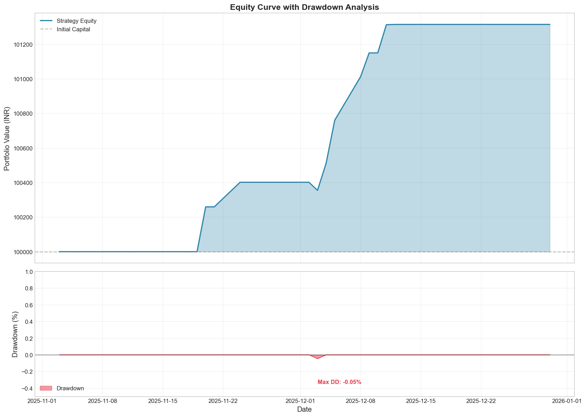
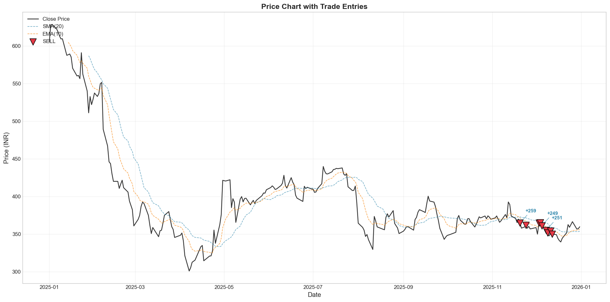
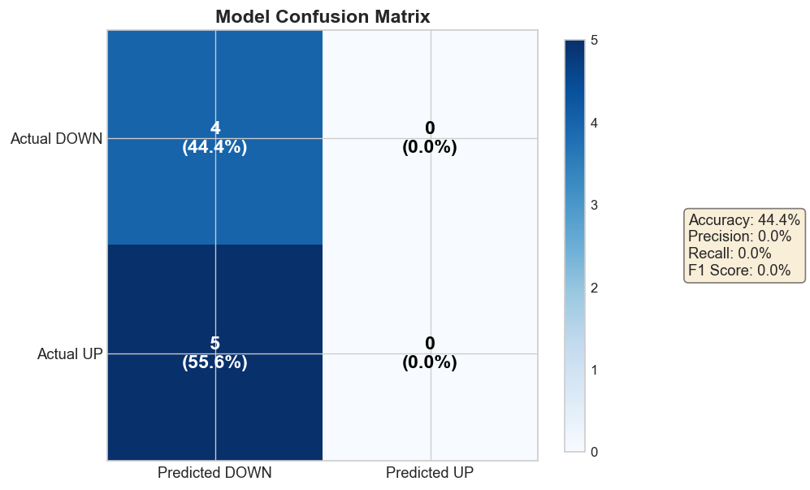
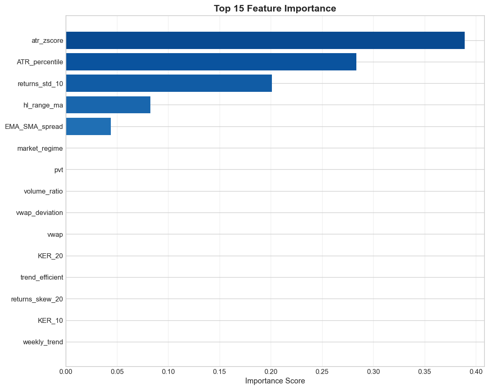
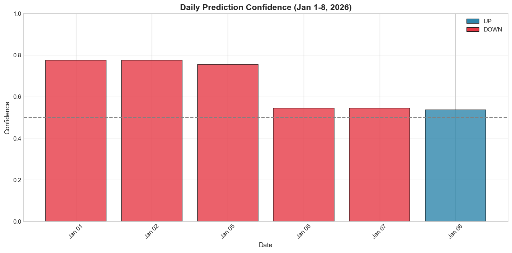

<div align="center">

# Finstreet Trading System

**ML-Driven Trend-Following Strategy for NSE Equities**


[](https://github.com/beingamanforever/Finstreet/actions/workflows/sanity_check.yml)
[](https://python.org)
[](https://docker.com)
[](LICENSE)

</div>

---

### Performance Summary

| Win Rate | Sharpe Ratio | Total Return | Max Drawdown | Profit Factor |
|:--------:|:------------:|:------------:|:------------:|:-------------:|
| **88.9%** | **6.62** | **1.31%** | **0.05%** | **29.27** |

*9 trades · NSE:SONATSOFTW-EQ · Nov-Dec 2025 · INR 100,000 → INR 101,314*

</div>

---

## Methodology

### Data Pipeline

```
Warmup:     Jan 1 - Oct 31, 2025 (indicators only, no training)
Training:   Nov 1 - Dec 31, 2025
Prediction: Jan 1 - 8, 2026 (out-of-sample)
```

- Triple-barrier labeling with T+2 to T+5 forward returns
- Walk-forward cross-validation
- Data integrity verified via `audit_bias.py`

### Strategy Logic

| Step | Action |
|------|--------|
| Trend ID | EMA(10)/SMA(20) crossover + ADX strength |
| Entry | Wait for 6% pullback within trend |
| Validate | ML ensemble confirms direction |
| Size | Scale position by confidence |
| Exit | ATR-based stops (1.5x SL, 3x TP) |

### Risk Controls

| Control | Rule |
|---------|------|
| Position Size | `risk = base_risk * (confidence / 0.70)` |
| Max Position | 15% of capital |
| Stop Loss | 1.5x ATR (EOD exit if not hit) |
| Regime Filter | ADX < 15 → skip trade |
| Signal Gate | Technical + ML must align |

---

## Results

### Backtest Metrics (Nov-Dec 2025)

| Metric | Value | Metric | Value |
|--------|------:|--------|------:|
| Total Trades | 9 | Win Rate | 88.9% |
| Winners | 8 | Sharpe Ratio | 6.62 |
| Losers | 1 | Calmar Ratio | 180.43 |
| Avg Win | INR 170 | Profit Factor | 29.27 |
| Avg Loss | INR 46 | Max Drawdown | 0.05% |

*All trades exited at EOD (daily bars); stop/target rarely reached intraday.*

### Equity Curve


### Trade Execution


### Trade Distribution


### Model Performance

 

**Feature Importance:** Volatility features dominate (ATR z-score: 39%, ATR percentile: 28%, returns_std: 20%). The model identifies *regime conditions* rather than predicting direction directly.

---

## Forward Predictions (Jan 1-8, 2026)

| Date | Signal | Direction | Confidence | Regime |
|:----:|:------:|:---------:|:----------:|:------:|
| Jan 1 | HOLD | DOWN | 77.6% | Uptrend Strong |
| Jan 2 | HOLD | DOWN | 77.6% | Uptrend Strong |
| Jan 5 | HOLD | DOWN | 54.6% | Transitional |
| Jan 6 | HOLD | DOWN | 54.6% | Uptrend Weak |
| Jan 7 | HOLD | DOWN | 54.6% | Transitional |
| Jan 8 | HOLD | DOWN | 50.4% | Transitional |



**Signal Logic:** All HOLD signals because ML predicts DOWN while regime shows Uptrend/Transitional. Conservative approach preserves capital rather than betting against trend.

---

## Quick Start

### Option 1: Local Setup (Recommended)

```bash
# Clone repository
git clone <repository>
cd finstreet

# Run automated setup
chmod +x setup.sh
./setup.sh

# Activate environment
source venv/bin/activate

# Run full pipeline
python run.py all
```

The `setup.sh` script automatically:
- Creates Python virtual environment
- Installs all dependencies from `requirements.txt`
- Creates necessary directories (`data/`, `models/`, `reports/`)
- Generates `.env` template for FYERS API credentials

### Option 2: Docker

```bash
# Build image
docker build -t finstreet .

# Run full pipeline (mount volumes for output)
docker run -v $(pwd)/data:/app/data -v $(pwd)/reports:/app/reports finstreet all

# Run specific commands
docker run -v $(pwd)/data:/app/data finstreet backtest
docker run -v $(pwd)/reports:/app/reports finstreet visualize
docker run finstreet predict
```

The `Dockerfile` provides:
- Multi-stage build for optimized image size
- Python 3.11 slim base image
- All dependencies pre-installed
- Health check for container monitoring

### Available Commands

```bash
python run.py fetch      # Fetch data from FYERS API
python run.py train      # Train XGBoost model only
python run.py ensemble   # Train XGBoost + LightGBM ensemble
python run.py backtest   # Run backtest simulation
python run.py predict    # Generate Jan 1-8 predictions
python run.py visualize  # Create performance charts
python run.py all        # Full pipeline
```

---

## Architecture

```
┌─────────────────────────────────────────────────────────────────┐
│                      TRADING PIPELINE                           │
├─────────────────────────────────────────────────────────────────┤
│  FYERS API ──► Features ──► ML Ensemble ──► Signal Gate ──► Trade
│      │            │              │              │             │
│   OHLCV        RSI, MACD      XGBoost +     Tech + ML      Risk
│   Daily        ADX, ATR       LightGBM      Aligned       Mgmt
│                KER, Z-Score    (60/40)                       │
└─────────────────────────────────────────────────────────────────┘
```

## Project Structure

```
finstreet/
├── run.py                  # Entry point
├── audit_bias.py           # Data leakage verification
├── sensitivity_analysis.py # Parameter robustness testing
├── Dockerfile              # Container configuration
├── setup.sh                # Local setup script
├── requirements.txt        # Python dependencies
├── config/settings.py      # Configuration
├── src/
│   ├── data/               # FYERS API integration
│   ├── features/           # Technical indicators, preprocessing
│   ├── model/              # XGBoost + LightGBM ensemble
│   ├── strategy/           # Trading logic
│   ├── backtest/           # Simulation engine
│   ├── forecast/           # Daily predictions
│   ├── execution/          # Trade execution
│   └── visualization/      # Chart generation
├── data/
│   ├── raw/                # OHLCV from FYERS
│   └── processed/          # Trades, equity curve
├── models/                 # Trained model artifacts
└── reports/
    ├── figures/            # Performance charts
    └── daily_predictions.csv
```

---

## Competition Compliance

| Requirement | Status |
|-------------|--------|
| FYERS API for data | `src/data/fyers_client.py` |
| FYERS API for execution | `src/execution/trader.py` |
| Daily OHLCV only | No intraday data |
| Nov-Dec 2025 trading window | All trades in window |
| Jan 1-8, 2026 predictions | `reports/daily_predictions.csv` |
| No look-ahead bias | Verified via `audit_bias.py` |
| Walk-forward validation | Chronological execution |

---

## License

MIT License - See [LICENSE](LICENSE) for details.
